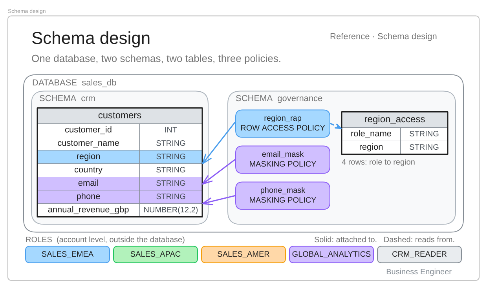
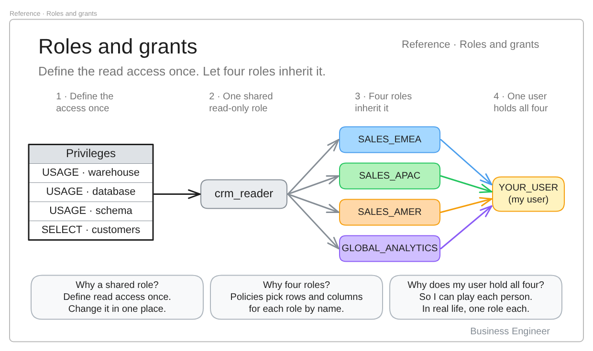

# Lab 01: Row-Level and Column-Level Security in Snowflake

**How do you stop one sales region from seeing another region's customers, without copying the data?**

This lab builds the answer on a single shared `customers` table: a row access policy decides **which rows** each team sees, and masking policies decide **what each team sees inside the columns**. Part of the [Business Engineer Labs](../../README.md) series.

> Video: *add the link here once published*

## The scenario

A global company has three sales teams (EMEA, APAC and AMER) and one analytics team. All four need the same customer table, which holds names, emails and phone numbers. Copying the table per team creates drift and governance headaches, so the goal is **one copy of the data and one set of rules**.

| Who | Rows they see | Email | Phone |
| --- | --- | --- | --- |
| Sales EMEA | Own region only (4 customers) | Visible | Visible |
| Sales APAC | Own region only (4 customers) | Visible | Visible |
| Sales AMER | Own region only (3 customers) | Visible | Visible |
| Global analytics | All regions (12 customers) | Masked | Masked |

The sample data has 12 customers: four in EMEA, four in APAC, three in AMER, and one with no region. That last row is deliberate and comes up in the bonus script.

## The design

One database, two schemas. The `crm` schema holds the data. The `governance` schema holds the mapping table and the three policies, kept apart from the data they protect.

Read access is defined once on a shared `crm_reader` role. The four team roles inherit it, and the policies then decide what each role actually sees.

## What you will learn

- How to separate **who can reach a table** (grants) from **what they see in it** (policies).
- How a row access policy reads a mapping table, so changing who sees what means editing one row, not rewriting the policy.
- How masking policies hide personal details for some roles and not others.
- Why a policy does nothing until it is attached, and how to prove what is attached.
- Three ways a correct-looking setup can still leak, and how to test for each.

## Requirements

- A Snowflake account on **Enterprise Edition or higher**. Row access and masking policies are not available on Standard Edition. A free trial on Enterprise Edition works.
- The `ACCOUNTADMIN` role, which a trial account gives you by default.
- A warehouse. Trial accounts include `COMPUTE_WH`. If yours is named differently, replace it wherever it appears.
- Your Snowflake username, for the grants in `02_create_roles.sql`.

## Quick start

1. In Snowsight, open **Projects**, then **Workspaces**, and create a new SQL file.
2. Open [`sql/00_create_database_and_schema.sql`](sql/00_create_database_and_schema.sql), paste it in, and run the statements in order.
3. Continue with the numbered files. In `02_create_roles.sql`, replace `<your_username>` with your own Snowflake username.
4. Read the `GOAL` and `WHY` comments as you go. They explain each step.

Tip: run one statement at a time so each result is easy to follow. In Snowsight, the run shortcut executes the statement your cursor is on.

## Script walkthrough

Run the main scripts in order. They are the same ones used in the video.

| File | What it does | You should see |
| --- | --- | --- |
| [`00_create_database_and_schema.sql`](sql/00_create_database_and_schema.sql) | Creates the database, schemas and the `customers` table with 12 rows | 12 rows loaded |
| [`01_simple_select.sql`](sql/01_simple_select.sql) | Looks at the data with a plain `SELECT` | Every region, real emails and phones |
| [`02_create_roles.sql`](sql/02_create_roles.sql) | Creates the roles and grants read access through `crm_reader` | Roles created |
| [`03_validate_the_problem.sql`](sql/03_validate_the_problem.sql) | Shows an EMEA salesperson reading every region | 12 rows, which is the problem |
| [`04a_create_mapping.sql`](sql/04a_create_mapping.sql) | Builds the mapping table of role to region | 4 rows |
| [`04b_create_and_attach_row_level_policy.sql`](sql/04b_create_and_attach_row_level_policy.sql) | Creates and attaches the row access policy, then tests each role | EMEA 4, APAC 4, AMER 3, analytics 12, admin 0 rows |
| [`05_create_column_data_masking.sql`](sql/05_create_column_data_masking.sql) | Creates and attaches masking policies, checks them, and tests each role | Real values for sales, masked for analytics |

### Bonus scripts

| File | What it does |
| --- | --- |
| [`bonus/07_break_it_on_purpose.sql`](sql/bonus/07_break_it_on_purpose.sql) | Reproduces three leaks and a common mistake, so you can recognise them |
| [`bonus/08_reset_and_cleanup.sql`](sql/bonus/08_reset_and_cleanup.sql) | Resets the policies or removes everything. Every command is commented out on purpose |

### The three leaks in the bonus script

A policy can be correct and the setup can still leak.

1. **Secondary roles.** With `USE SECONDARY ROLES ALL`, roles you hold in the background widen what a session sees. Test each role with `USE SECONDARY ROLES NONE`.
2. **Role hierarchy.** Grant a data role to `SYSADMIN` and `ACCOUNTADMIN` inherits it, so the admin suddenly sees data. Default deny only holds until a grant says otherwise.
3. **The orphan row.** A `NULL` region matches nothing in the mapping table, so only a role mapped to `ALL` can see that customer. Decide deliberately who owns rows with missing keys.

## Troubleshooting

| Problem | Likely cause and fix |
| --- | --- |
| "No active warehouse" after switching roles | The role lacks `USAGE` on the warehouse. Re-run the grants in `02_create_roles.sql` and check the warehouse name. |
| Everyone still sees all rows | A policy exists but is not attached. Run the `POLICY_REFERENCES` query in `05_create_column_data_masking.sql` to see what is enforced. |
| A salesperson sees more rows than expected | Secondary roles are active. Run `USE SECONDARY ROLES NONE` and test again. |
| The admin sees zero rows | Expected. The mapping table gives `ACCOUNTADMIN` no region, so default deny applies. |
| Policy creation fails on a Standard account | These policies need Enterprise Edition or higher. |

## Cleaning up

Trial credits are not unlimited. The first script sets the warehouse to auto-suspend after 60 seconds. When you are finished, use [`bonus/08_reset_and_cleanup.sql`](sql/bonus/08_reset_and_cleanup.sql) to reset the policies or delete the database and roles. Every command there is commented out, so a "Run all" cannot delete your work by accident.

## Further reading

- [Written guide](docs/guide.md): the full walkthrough with explanations.
- [Snowflake documentation: row access policies](https://docs.snowflake.com/en/user-guide/security-row-intro)
- [Snowflake documentation: dynamic data masking](https://docs.snowflake.com/en/user-guide/security-column-ddm-intro)

---

*Part of the Business Engineer series: turning technology into business outcomes.*
